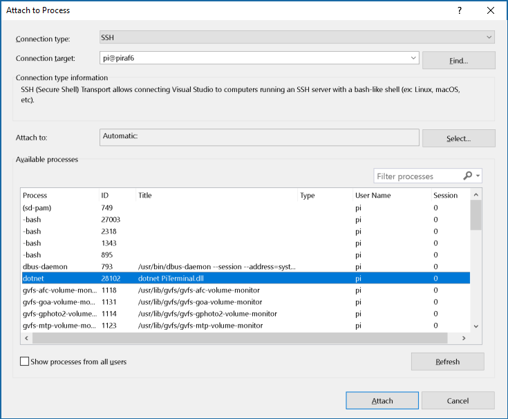
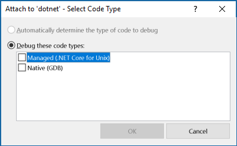
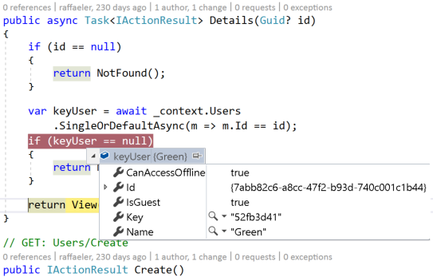

# Debugging NetCore on the Raspberry PI
This article refers to the ability to remotely debug an application running on the Raspberry PI. Even if it focuses on debugging from Windows, most of the settings is compatible with Visual Studio Code from either Windows or Linux.

The debugger has been improved starting from Visual Studio 2017 version 15.3. This article has been tested on Visual Studio 2017 15.7.0 Preview 1 and the NetCore ARM sdk version 2.1.300-preview2-008375.

## Prerequisites

Ensure the [SSH daemon has been enabled](GettingStarted.md) on the Raspberry PI so that the debugger can use this protocol to establish the communication with the device.

Install the latest SDK version 2.1 or greater as described [here](InstallingSDK.md).

## Setting up the debugging machine
The debugging machine should install VS2017 or VSCode (latest releases) with the .NET Workload (VS) or the C# extension (VS Code).
In Visual Studio 2017, configure the connection to the Raspberry PI in Tools - Options as for this dialog:

[](images/VS-debugger1.png)

## Setting up the debuggee machine (Raspberry)
The first step is to make a first debugging attempt so that a script file is copied on the Raspberry PI. Run an application on the Raspberry PI and try to attach it from Visual Studio (menu Debug - Attach to Process):

[](images/Attach-Process.png)

*Tip: you can leave the application running and open a second terminal to the Raspberry PI to run the other commands listed from now on.*

After pressing attach, a request for the debugger type is issued with the following dialog. Please select the managed debugger and press OK.

[](images/Debugger-Kind.png) 

After pressing OK, a script on the Raspberry PI is run to download the debugger engine.
This first attempt will fail because in this preview we need to make a small change to the script.

When the dialog closes, edit the script file:
```
cd .vs-debugger
*nano GetVsDbg.sh
# change the __SkipDownloads=true
# exit with Ctl-X  Yes
```

Now we can download manually the latest debugger engine:

```
# recursively delete the 'wrong' debugger folders
rm -rf vs2017u5
mkdir vs2017u5

# download and expand the debugger files in the vs2017u5 folder
curl -sSL https://aka.ms/getvsdbgshbeta | bash /dev/stdin -r linux-arm -v latest -l ~/.vs-debugger/vs2017u5
```

*With those changes, VS2017 will no longer try to overwrite the debugger engine with the 'wrong' one. This happens because we are using a preview and the default debugger is older and does not work with the current bits.*

Now you can re-attach the debugger again selecting 'Reattach to Process' from the menu Debug.
At this point set a breakpoint on the code and navigate the aspnetcore page to hit that breakpoint.

[](raspberry-debug.png)

*Note: alternatively it is possible to download manually the debugger in an arbitrary folder and then create on the debugger machine (VS2017 or VS Code) a launch.json file specifying the all the debugger parameters, including the remote folder containing the debugger.*

## References
The official page of the MIEngine debugger:
[https://github.com/Microsoft/MIEngine/wiki/Offroad-Debugging-of-.NET-Core-on-Linux---OSX-from-Visual-Studio]()

An interesting issue on debugging Omnisharp project on ARM:
[https://github.com/OmniSharp/omnisharp-vscode/issues/1562]()

The wiki page of the Omnisharp project about debugging:
https://github.com/OmniSharp/omnisharp-vscode/wiki/Remote-Debugging-On-Linux-Arm]()

