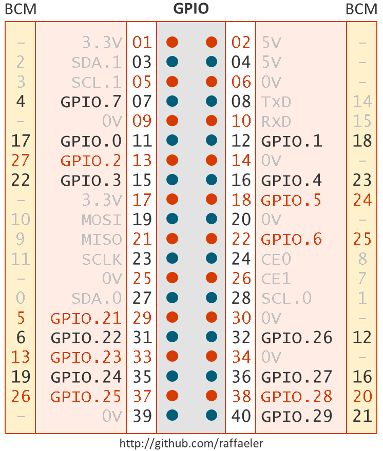

# Start developing with .NET Core and the Raspberry PI
## Useful resources for the Raspberry PI and NetCore 2.0

## GPIO
While there are already many libraries available for C# and Mono, at the time of writing there are just two available that are **nestandard** and therefore fully compatible with NetCore. More are expected, it is just a question of time.

## Unosquare Library
The first library is [https://github.com/unosquare/raspberryio](https://github.com/unosquare/raspberryio) which is a wrapper around [WiringPI](http://wiringpi.com/) C library.

## Pi Library
The [Pi library](https://github.com/Petermarcu/Pi) is authored from Peter Marcu which is a member of the dotnet team. It has been derived from the [raspberry-sharp library](https://github.com/raspberry-sharp).

# The WiringPI and BCM (Broadcom) conventions

