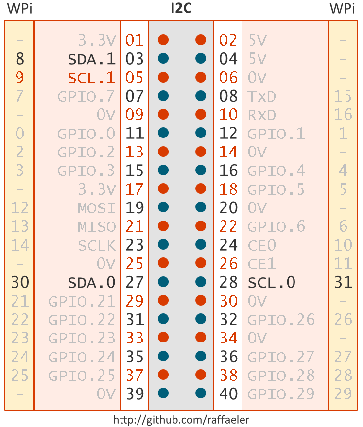
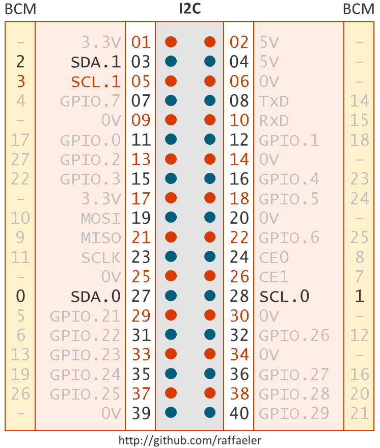

# Start developing with .NET Core and the Raspberry PI
## Useful resources for the Raspberry PI and NetCore 2.0

## I2C
The upcoming library System.Devices.GPIO can manage the I2C bus as well.

# The WiringPI and BCM (Broadcom) conventions

