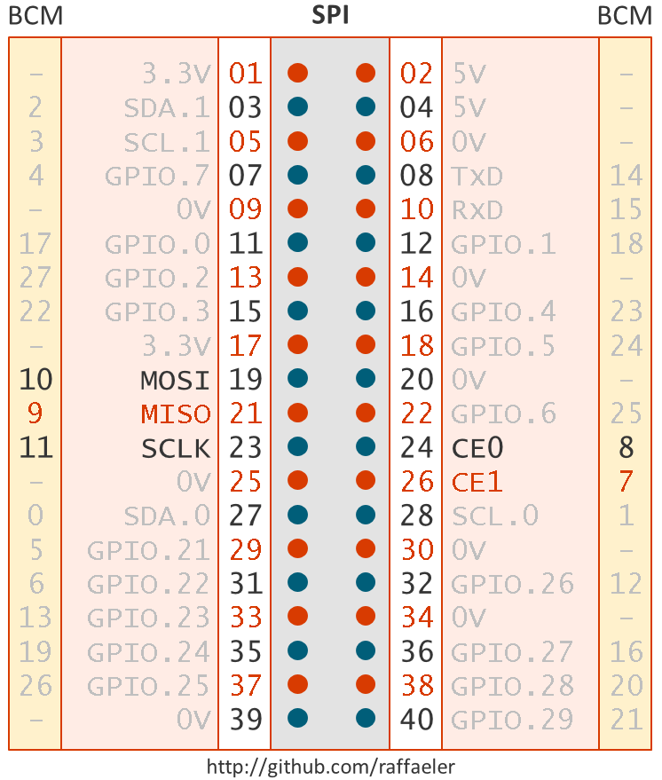

# Start developing with .NET Core and the Raspberry PI
## Useful resources for the Raspberry PI and NetCore 2.0

## SPI
The upcoming library System.Devices.GPIO can manage the SPI bus as well.

# The WiringPI and BCM (Broadcom) conventions

